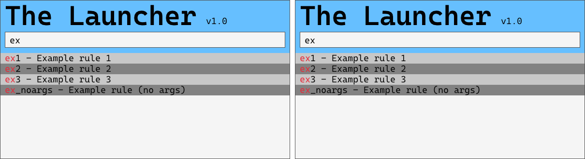

<!-- omit in toc -->
# The Launcher

A fast configurable launcher



Status: abandoned. Use [Launcher2](https://github.com/xefiry/Launcher2) instead.

## Build

For Windows without cgo (CGO_ENABLED=0), the raylib.dll v5.5 is included in this repository.

For other OS or Windows with cgo, check [raylib-go Requirements](https://github.com/gen2brain/raylib-go#Requirements).

### Automatic build

Use the python script to build the program and create a ready to use .zip file.

```shell
python build.py
```

### Manual build

Use this command to build for release

```shell
go build -ldflags "-H=windowsgui -w -s"
```

- `-H=windowsgui` remove console window, it greatly improves performances
- `-w -s` reduces final binary size by stripping debug symbols

The final executable should be shipped with

- Fonts directory containing used fonts
- config.toml
- raylib.dll (for Windows)

## Limitations

- There can not be comments in the config.toml file
- The launcher can not start command line or TUI programs (e.g.: ffmpeg, vim) directly, because they will not show. The workaroud is to start a terminal emulator with args to execute it. See examples in config.toml.

Open Windows terminal and run pwsh.exe with a python script

## Controls

**ToDo** : write this

## Configuration

**ToDo** : write documentation about config.toml syntax, and a few concrete examples.

### Example rules

#### Static rules

| Typed     | Description           | Command                           |
| --------- | --------------------- | --------------------------------- |
| Desktop   | Open Desktop folder   | explorer.exe <desktop_location>   |
| Documents | Open Documents folder | explorer.exe <documents_location> |
| SVN       | Open SVN folder       | explorer.exe C:\SVN               |
| py        | Start python script   | pythonw.exe python_script.pyw     |

#### Dynamic rules

These rules will use regular expressions. Not implemented yet.

| Typed            | Description                   | Command                                                         |
| ---------------- | ----------------------------- | --------------------------------------------------------------- |
| py {arg}         | Start python script with args | python_script.pyw {arg}                                         |
| r/{sub}          | Go to r/{sub}                 | firefox.exe <https://www.reddit.com/r/{sub}/>                   |
| r/{sub} {search} | Search on r/{sub}             | firefox.exe <https://www.reddit.com/r/{sub}/search/?q={search}> |
| r {search}       | Search on Reddit              | firefox.exe <https://www.reddit.com/search/?q={search}>         |

## Resources

- Font Cascadia code : <https://github.com/microsoft/cascadia-code>
- Raylib DLL : <https://github.com/raysan5/raylib/releases/tag/5.5>

## ToDo list

List of ideas to implement in no particular order

- GUI: Manage mouse scroll to scroll rules
- Misc: Simplify Rule.GetDisplayStrings
- GUI: Improve selected row display
- Rule: Manage environment variables in rule Exe/Args
- GUI: Ctrl + Z / Ctrl + Shift + Z to undo/redo
- Rule: Add regexp management in rules
- GUI: Ctrl + V to paste text (use rl.GetClipboardText)
- Misc: Comment the code some more
- Commands: Add standard commands
- Commands: Add /config - edit configuration file
  - Add setting for default editor
- Commands: Add /reset - reset all LastUse values
- Misc: Refactor GUI_Start function (Create a GUI class with methods) ?
- Misc: If config.toml is not found, create it with a few examples dummy rules
